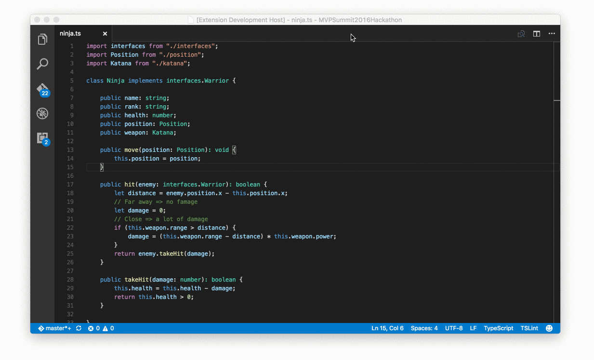

# 2016 MVP Global Summit Hackathon
This VS Code extension was developed during a hackathon at the 2016 Global MVP Summit.

This extension allows you to auto-generate UML diagrams for TypeScript applications:

## About this repo
The application was finished during my flight back from Seattle to Ireland. Please do not expect this to be a production-ready extension: **IT IS JUST AN EXPERIMENT**.

I decided to share the repo because it could be used as a reference in the development
of VS Code extensions.

You can use this repo to find out the following:

- How to use the TypeScript language service to access the AST generated by the TypeScript compiler.
- How to traverse the AST.
- How to access user-geerated source code from a VS Code extension.
- How to create custom VS Code commands.
- How to render a new page after triggering custom VS Code commands.

## About the source code
This repo is divided in two main components.

### /src/core
The `core` folder exposes a function named `getDiagram`. 

This function expects an array of paths to be passed as 
an argument. The paths should point to some TypeScript 
source files.

The `getDiagram` function uses other core components:

- **Parser**: Traversed the TypeScript AST to create a `ClassDetails` data structure.
- **Serializer**: Transfroms `ClassDetails` data structure into the UML DSL.
- **Renderer**: Transforms the DSL into a SVG class diagram.

The function returns a `Promise<string>`. If the promise
is fulfilled, the returned string value will contain a svg diagram.

### /src/extension & /src/provider
Contains the actial VS Code extension. It declares a new custom
command. When the command is executed the current source file is
passed to the code to get a class diagram. The diagram is then
displayed in a new panel.

## Missing features
Feel free to send PRs:
- Display inheritance relationships
- Display composition relationships
- Display "implements"

## Resources
I used the following links during the hackathon:
- https://github.com/Microsoft/TypeScript/wiki/Using-the-Compiler-API
- https://github.com/skanaar/nomnoml
- https://code.visualstudio.com/docs/extensionAPI/overview
- https://code.visualstudio.com/Docs/extensions/example-hello-world
- https://code.visualstudio.com/docs/extensionAPI/vscode-api
